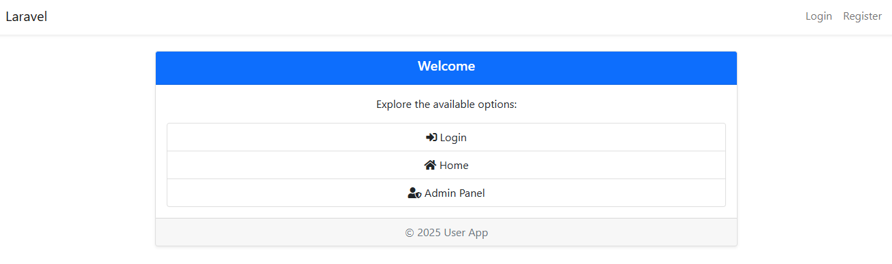
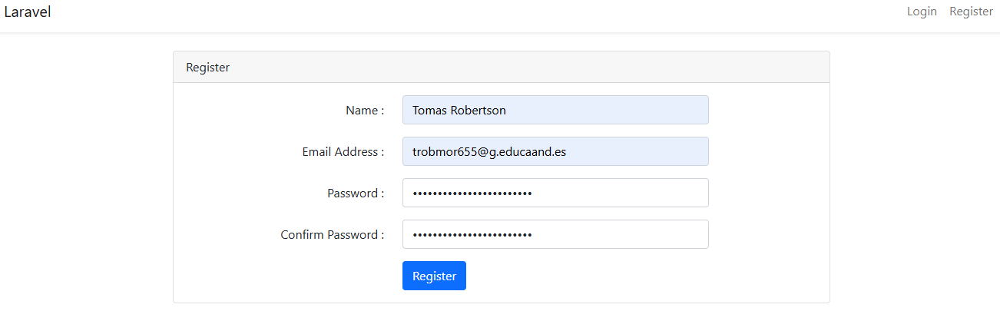
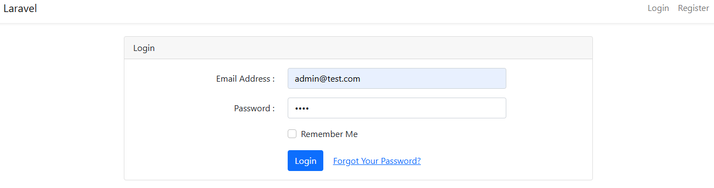
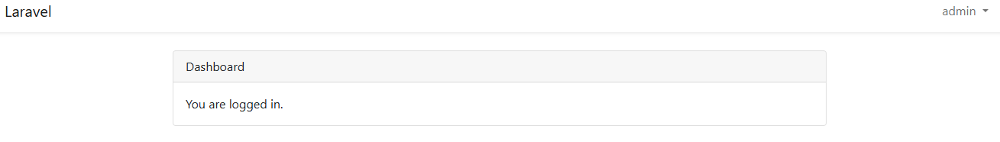
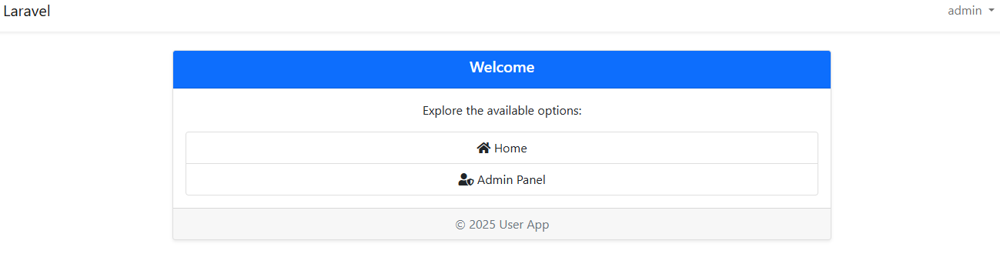
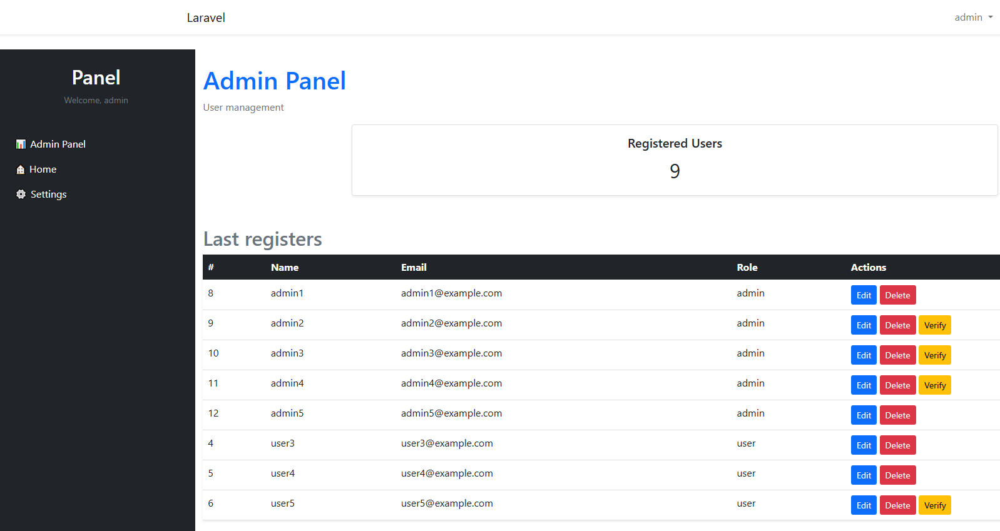
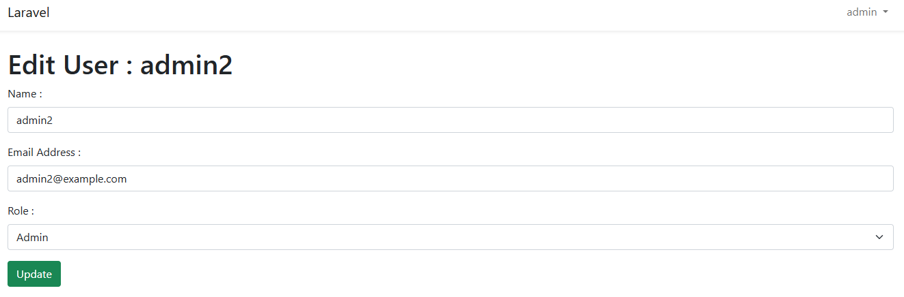
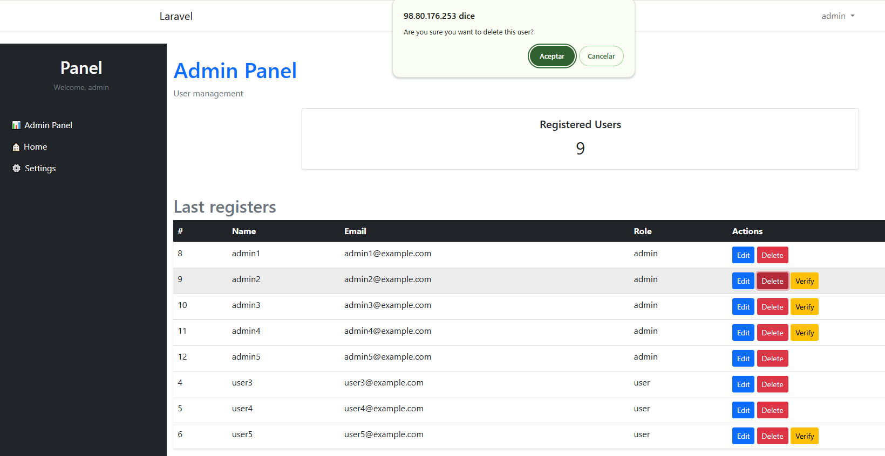
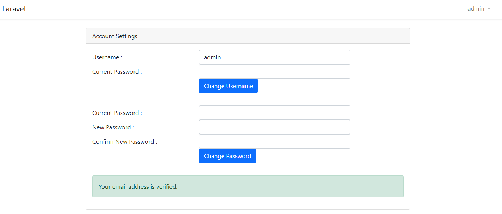

# User App

## Welcome without being logged in

## Register a user who later can be turned into an admin by another admin

A user receives an email to register itself officially. But a user can be verified directly by an admin.

## Login for a a registered user

## Home page for a user to show that they are logged in

## Welcome being looged in

## Admin panel only accessible by admins

## Edit page for editing a user

## Delete pop-up to verify the deletion of a user

## Settings page

